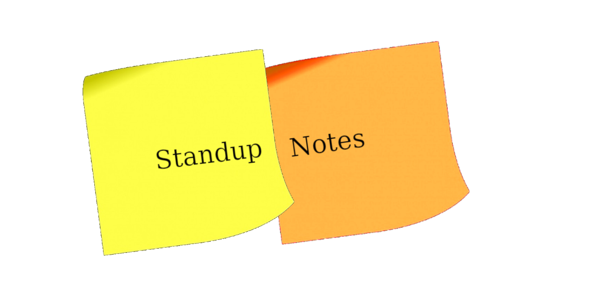

A simple way to capture notes for your daily standup meetings.

https://mikemartino.github.io/standup_notes/

## Installation
### From source

```
python3 -m pip install pipenv 
python3 setup.py install --user
```
### From PyPi

```
pip3 install standup-notes
```
### Bash Setup
For a 1 time execution, use
```
source /path/to/standup-notes.bash
```
To permanently have bash completion, find where the bash_completion.d file is in your system
```
pip3 show standup-notes
```
Under the Location: tab, this is where ```bash_completion.d``` is located
Run the following command to copy the bash completion script to the correct directory
```
cp /path/to/standup-notes.bash /path/to/bash_completion.d
```
## Commands
##### Day Flags
```
--yesterday
--today
--tomorrow
```
Pass the flags to the read, copy and edit execution to manipulate their respectives standup-notes
##### List
 ```
standup-notes --l
standup-notes --list
 ``` 
 will list commands that can be run by the script
#### Read
 ```
standup-notes --r
standup-notes --read
 ``` 
will print out the stand up note based on the date flag passed
####Copy
```
standup-notes -c
standup-notes --copy
```
will copy the standup-notes to the date selected to your clipboard
####Edit
```
standup-notes -e
standup-notes --edit
```
will edit the note selected based on date flagged passed
Passing the copy argument will allow you to copy the previous days "What I did Today" into "What I did yesterdays" section of that days note
```
standup-notes -e --today -c 
standup-notes -edit --today --copy
```


####Delete Notes
```
standup-notes -d
standup-notes --delete
```
Deletes all notes that are older then the date inputted, format of date input shown below
```
standup-notes -d YYYY-MM-DD
standup-notes -d 2020-05-05
```
This will delete any notes older then May 5th 2020


# Why? Why not?

__Tired__ of opening `nano` on your own?

__Forget__ if you like headings or italics for your standup section titles?

__Stuck__ in that weird `VISUAL MODE` in `vim` where you can't right-click copy and paste your notes into chat? Looking like a tool, because you aren't using the right ones.


***

_**Well, no more.**_

`standup-notes` to the rescue.

***

## Brag hard about your $EDITOR selection
 
Set your `$EDITOR` environment variable (in your __.bashrc__) to tell `standup-notes` and your friends, 

> "Yo playa', I use __X__ to edit my files. Like a boss!" 

## Only chumps right-click to _Copy and Paste_

You heard me. And I know you're no chump. Use `standup-notes` to seamlessly `--copy-today`'s notes and by ready for that meeting on the fly. So fly.

## I have kids. I don't sleep. My brain is basically just scrambled eggs. I use templates.

Get to the point. I can't remember what I like (italics vs. headings). I just do what my template tells me. 

Don't waste time with that cookie cutter garbagio. Get straight to the content. Leave the boilerplate to the tool. 
